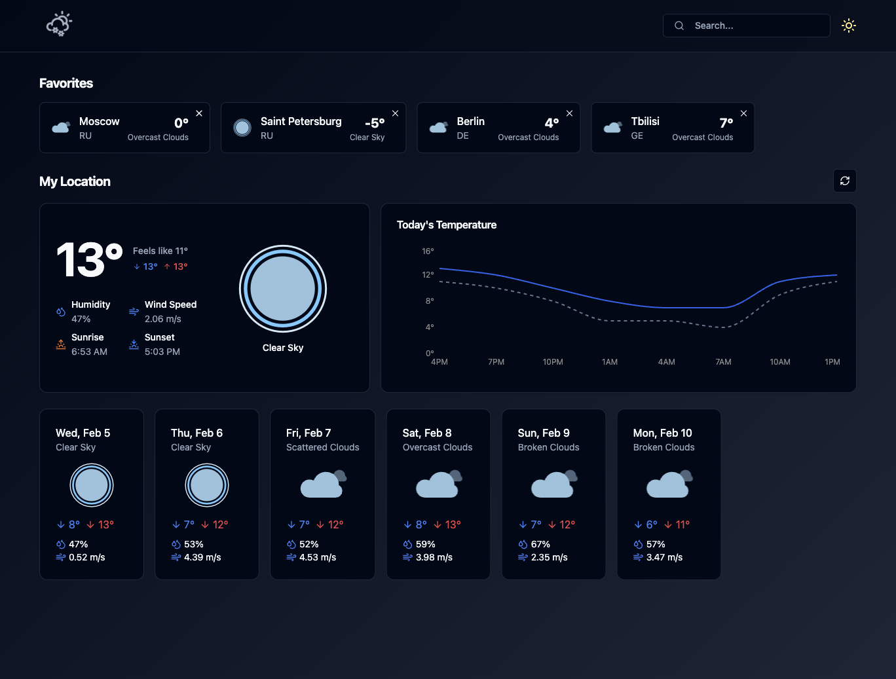

# React Query Weather App



## Tech Stack

- **React**: A JavaScript library for building user interfaces.
- **TypeScript**: A strongly typed programming language that builds on JavaScript.
- **Vite**: A fast build tool for modern web projects.
- **Lottie**: For adding animations.
- **Tailwind CSS**: A utility-first CSS framework.
- **Shadcn/ui**: Accessible and customizable components.
- **React Query**: For fetching, caching, and updating data in React applications.

## Installation

1. Clone the repository:
    ```sh
    git clone https://github.com/your-username/react-query-weather-app.git
    cd react-query-weather-app
    ```

2. Install dependencies:
    ```sh
    npm install
    ```

## Running the App

1. Start the development server:
    ```sh
    npm run dev
    ```

2. Open your browser and navigate to `http://localhost:3000`.

## Features

- **Weather Forecast**: Get the current weather and forecast for the next few days.
- **Animations**: Beautiful weather animations using Lottie.
- **Responsive Design**: Fully responsive design using Tailwind CSS with light and dark modes.
- **Data Fetching**: Efficient data fetching and caching with React Query.
